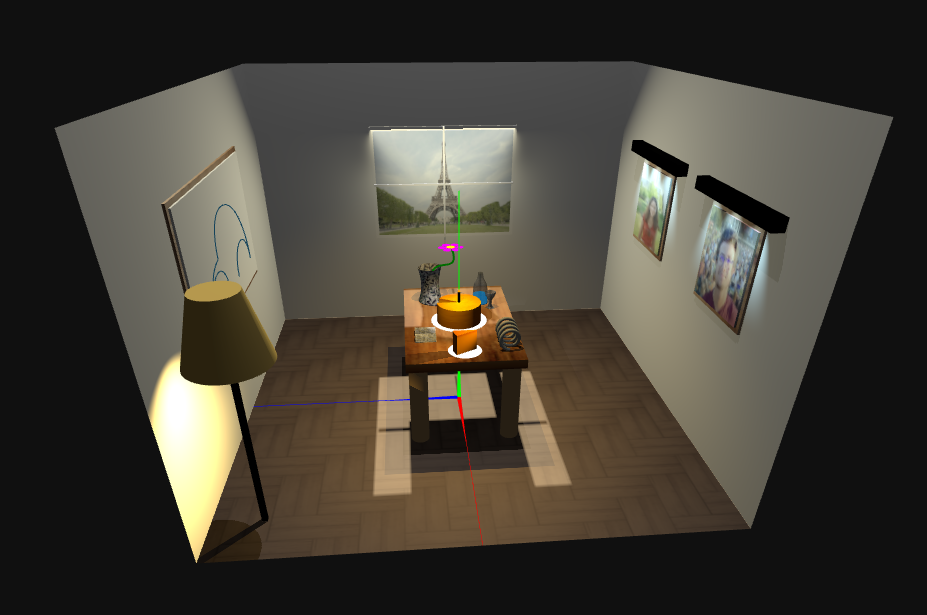
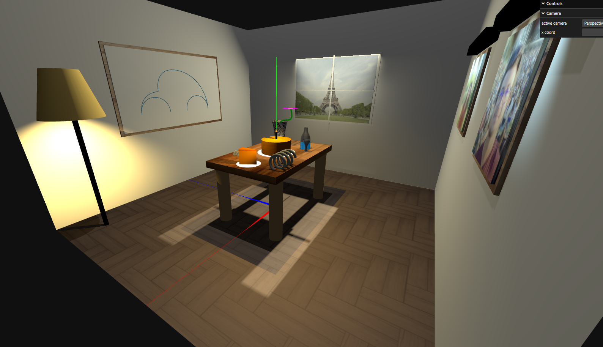
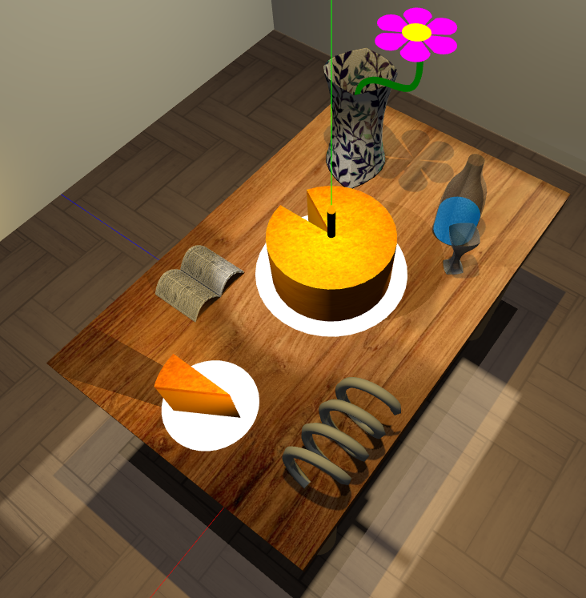

# SGI Project 1

## Group T03G35
| Name             | Number    | E-Mail             |
| ---------------- | --------- | ------------------ |
| Inês Gaspar      | 202007210 | up202007210@up.pt  |
| José Gaspar      | 202008561 | up202008561@up.pt  |

## Name
Solitary Celebration

## Description
The scene created during the development of Project tp1 consists of the dining room of a house in Paris (visible from the window) during a birthday celebration. This room is made up of several paintings: two of two people and another of a car. Also visible is a window that acts as a light source, allowing the space to be illuminated by external light. As for the other objects that make up the scene, we have a lamp that serves as local lighting for the room and a table. This table has a cake with a candle, a slice of which is missing, on a plate also placed on the table. Near the cake is a bottle of water and a glass, as well as a spring, a newspaper and a vase with a flower.

## Visuals
Below are some screenshots of the scene created in order to visualize the final result in greater detail.

## Installation
This app runs on a browser. It is necessary to address a port for your computer to run this. To do this you can simply use vscode with the "Go live" extension. This extension binds the required port to your project without adicional work besides clicking on a single button. Then just go to your browser (ex: https://localhost:5500)

## Usage
After accessing the work in your browser the scene will be displayed.

## Contributing

### Highlights
* Jar - Builded using nurbs and using seamless texture in order to recreate an actual ceramic vase.
* Bottle - Using nurbs with a transparent material we could simulate glass and with the help of a cylinder on the inside it was possible to replicate a liquid inside.
* Window - The window allows light from the outside to enter through the window simulating the sun rays, contributing for a better illumination.
* Board Suport Illumination - The little suport with small spotlights above boards make them look nicer.

### Dificulties
* We had some difficulties with the lighting, particularly with how to make the window and apply the light source so that it looked natural. In the end, we decided to use a false wall with a hole in the same place where we have the window in the wall and put a directional light behind it so that it looks like the light is going through it.
* We also had some difficulties understanding how to make and modulate curved surfaces (Nurbs).

## Authors and acknowledgment
The authors of this project are the students: Inês Sá Pereira Estêvão Gaspar and José Albano de Almeida Gaspar

## License
No license required

## Project status
The project is concluded. All the milestones were achieved successfully.
