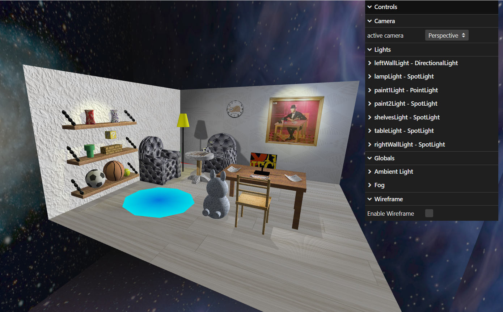
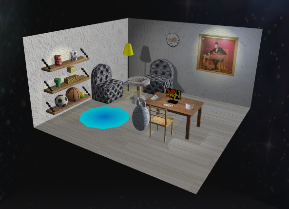
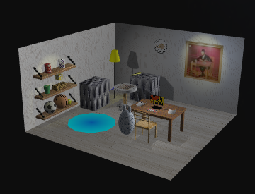

# SGI Project 1

## Group T03G35
| Name             | Number    | E-Mail             |
| ---------------- | --------- | ------------------ |
| Inês Gaspar      | 202007210 | up202007210@up.pt  |
| José Gaspar      | 202008561 | up202008561@up.pt  |

## Name
Home Office

## Description

In this project, we started to represent the scene by reading the parsed xml file. Then, we constructed a scene that represents a home office in the space.
The scene has the following objects:
- 2 Walls
    - One with bump texture, other without.
- Floor
- Table
    - On the table we can find papers (nurbs) and a keyboard (rectangle) besides a computer playing a video.
- Teddy bear
    - This teady bear can be seen next to the table and has lods implemented.
- Wooden Chair
- Sofas
    - 2 sofas can be seen. Lods and bump textures were used.
- Smaller table
    - This table has a checkers board with pieces on it.
    - Different textures were used.
- Chandelier
- Clock
- Painting with mipmaps
- Shelves
    - Firt shelf - 2 jars (nurbs) with lods implemented.
    - Second shelf - Super Mario World with some blocks, item block plus a pipe.
    - Third shelf - 3 balls.
- Carpet
    - Carpet implemented using buffer geometry.
- Illumination
    - All 3 types of lights are displayed. All of them can be controlled via the 2D interface.
- Cameras
    - All 2 types of cameras are created on xml and can be selected individually via the 2D interface.  

## Contributing

### Highlights
* Ilumination and Shadows - A point that we consider to be a strength of our work is the light sources and shadows. Those lights can be changed on the 2D interface.
* Textures - We have defined materials with the different textures we have implemented: simple textures, repetitions on objects, mipmaps, bump textures and video textures.
* Diversity of objects - We have several objects in our scene, some simple and others complex, and using the various primitives we have available.

### Dificulties
* We had some difficulties understanding how the LODs and the xml structure for these elements.
* We also had some difficulties with the buffer geometry, especially when it came to creating the indices for the various triangles that had to be built.

## Authors and acknowledgment
The authors of this project are the students: Inês Sá Pereira Estêvão Gaspar and José Albano de Almeida Gaspar.

## License
No license required.

## Project status
The project is concluded. All the milestones were achieved successfully.

## Visuals
Below are some screenshots of the scene created in order to visualize the final result in greater detail. In the screenshots you can see the 3 levels of LODs we set for some objects:

