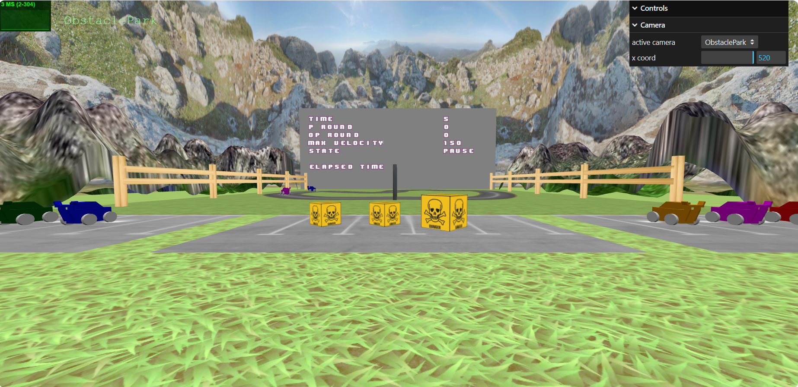

# SGI 2023/2024 - TP3

## Group: T03G05

| Name             | Number    | E-Mail               |
| ---------------- | --------- | -------------------- |
| Inês Gaspar         | 202007210 | up202007210@up.pt |
| José Gaspar         | 202008561 | up202008561@up.pt |

## Name
FEUP Turismo

## Project information

- The project is divided into several states:
  - Initial menu
  - Choosing player cars
  - Choosing difficulty
  - Game
  - Choosing obstacles
  - Final results
  
- All the states are navigatable via picking. However due to a bug (described below) the camera switch should be performed via interface and not occour automatically.
- All techniques were implemented-
- On the initial menu the player can input its name and start the program.
- Gameplay
  - The automatic car follows a pre-defined route - dificulty level and the wheels as weel as the position and rotation are computed based on that route.
  - The game as a pause mode - esc key.
  - If the player left the track the velocity of the car is decreased to simulate a real acident (however you can return to the track and move on):
    - This was made using a technique that consisted on taking a photo (top view) of the track (track is white on the photo and background on other color) then the white pixels represent the inside of the track.

  - When the powerup gets hit you must move to the obstacles parking lot, select the object, go to the perspective camera of the game and click on the track to place the obstacle on the game.
  - The power up collision gives the car a higher velocity.
  - The obstacle collision changes the keys responsible to turn left and right.
  - If the player bumps into the other car, the player stops for 5 seconds.

- When the game ends an outdoor is being displayed with the requested information from the given statement.
  - Fireworks are also being displayed.
- The player can then restart and play again or exit to the main menu.

- Extras:
  - A skybox, fences and a banner over the starting line were introduced to enrich the scenario.
  - The mountains, animated with shaders, also contribute for better visuals.
  - The obstacles have a pulsating effect as requested and also, they rotate over themselves (addicional feature) - all computed with shaders.

## Issues/Problems

- We have a bug when changing between cameras. This bug only applyies to the cameras on the state of choosing obstacles and all the consecutive states.
- We have a bug in the update of the sprite of maximum velocity when we collide with a powerup and is a restarted race, because the maximum velocity don't update to the normal one.
- Sometimes, after putting an obstacle in place, it is necessary to click on the grass with the mouse for the game to continue.

## Visuals

